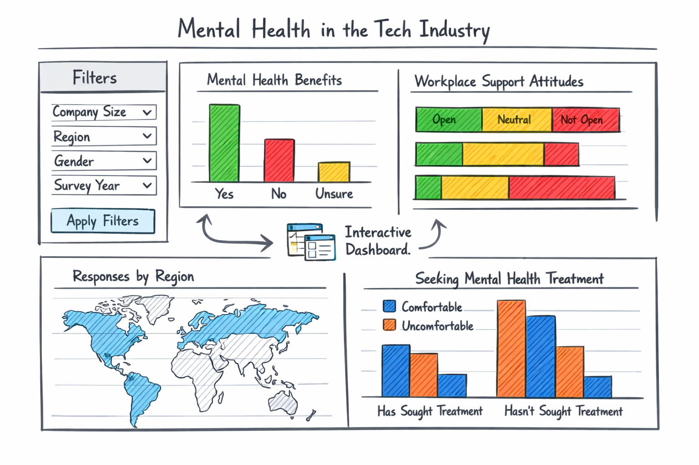

# Mental Health in the Tech Industry Dashboard

An interactive dashboard for exploring mental health attitudes, workplace culture, and organizational support in the technology industry.

🚧 **Deployed app link:** 

https://mental-health-tech-industry-551-project-bbdv.onrender.com/

---

## Part I — Dashboard Output (For Users)

### What is this dashboard?

This dashboard provides an interactive interface for exploring survey data on mental health in the technology industry. It is designed for **exploratory analysis**, allowing users to examine how treatment-seeking behavior and workplace support relate to demographic and organizational factors.

The dashboard is intended for:
- HR professionals and people operations teams  
- Organizational decision-makers  
- Researchers and students interested in workplace mental health  

### What can you explore?

Users can interactively explore:
- Mental health treatment rates across demographic groups
- Relationships between work interference and treatment-seeking
- Availability of workplace mental health support (e.g., benefits, help-seeking culture)
- Differences across company size, region, gender, age group, and survey year

### How does it work?

The interface consists of:
- Global filters (dropdowns and multi-select controls)
- Summary KPI cards
- Coordinated visualizations including bar charts, stacked bar charts, and a heatmap

All visualizations update dynamically based on the selected filters, supporting both overview and focused subgroup exploration.

### Dashboard sketch



---

## Part II — Code & Development (For Developers)

### Repository structure
```
project/
├── data/
│ ├── raw/
│ └── processed/
│ └── cleaned.csv
├── src/
│ ├── init.py
│ └── app.py
├── reports/
├── doc/
│ └── reflection-milestone2.md
├── requirements.txt
├── Procfile
└── README.md

```

### Running the app locally

1. Install dependencies:
```bash
pip install -r requirements.txt
```
2. Run the Dash app:
```bash
python src/app.py
```
3. Open a web browser and navigate to `http://127.0.0.1:8050/`
4. Interact with the dashboard using the filters and visualizations.

## Key implementation notes

- The dashboard is built using **Dash** for layout, callbacks, and interactivity.
- **Altair** is used for visualization and embedded into Dash using `html.Iframe`.
- Charts are rendered with `inline=True` to avoid external CDN dependencies.
- The application expects a processed dataset at: data/processed/cleaned.csv


---

## Deployment

The application is configured for Linux-based hosting platforms (e.g., **Render** or **Heroku**) using the following `Procfile` entry:

```text
web: gunicorn src.app:server
```

**Note:** `gunicorn` does not run on Windows locally due to Unix-only dependencies.  
This is expected and does not affect deployment on Render or Heroku.

Deployment progress and known issues are tracked via GitHub issues.

---

## Project status

This repository contains the **Milestone 2 prototype** of the dashboard.

- Core data preparation and dashboard functionality are complete.
- The application runs locally and supports interactive exploration.
- Public deployment is documented and in progress.
- Additional features and refinements will be addressed in later milestones.

---

## Glossary

- **Dashboard**: An interactive interface for visual data exploration.
- **Exploratory analysis**: Analysis focused on understanding patterns rather than prediction.
- **Milestone**: A defined stage of development in the project lifecycle.
- **Issue**: A GitHub feature for tracking tasks, enhancements, and known limitations.